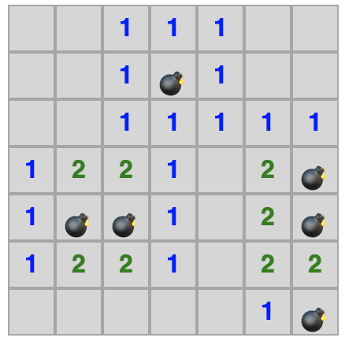

# Codekata - Minesweeper

**2021-05-13**

Minesweeper is a game in which, the goal is to find all the mines within a field.

To help the user, the game shows a number in a square which tells you how many mines there are adjacent to that square.



For instance, take the following 4x4 field with 2 mines.

```js
[
  [1, 1, 1, 0],
  [1, '💣', 2, 1],
  [1, 2, '💣', 1],
  [0, 1, 1, 1],
];
```

## Challenge

### 1. Empty board

```js
const input = [
  ['', '', '', ''],
  ['', '', '', ''],
  ['', '', '', ''],
  ['', '', '', ''],
];
```

```js
output ===
  [
    [0, 0, 0, 0],
    [0, 0, 0, 0],
    [0, 0, 0, 0],
    [0, 0, 0, 0],
  ];
```

### 2. Mine in the center of the board

```js
const input = [
  ['', '', '', ''],
  ['', '💣', '', ''],
  ['', '', '💣', ''],
  ['', '', '', ''],
];
```

```js
output ===
  [
    [1, 1, 1, 0],
    [1, '💣', 2, 1],
    [1, 2, '💣', 1],
    [0, 1, 1, 1],
  ];
```

### 3. Mine on the edges of the board

```js
const input = [
  ['💣', '', '', '💣'],
  ['', '', '', ''],
  ['💣', '', '', ''],
  ['💣', '💣', '', '💣'],
];
```

```js
output ===
  [
    ['💣', 1, 1, '💣'],
    [2, 2, 1, 1],
    ['💣', 3, 2, 1],
    ['💣', '💣', 2, '💣'],
  ];
```

## TDD


